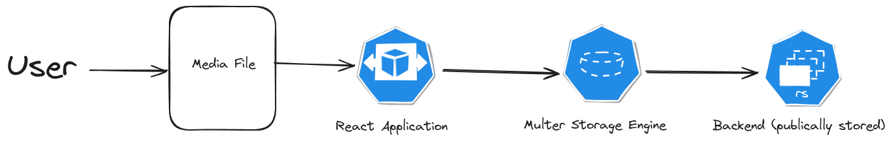

# PloadNPlay

A project that allows user to upload media and stream that..

## Workflow



## Setup
### Frontend

```bash
cd frontend && npm i
npm start
```
### Backend
```bash
cd backend && npm i
npm start
```
### Docker
```
docker-compose up
```

## Deployment Link
